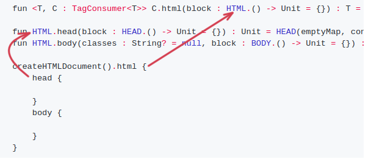

### HTML DSL (typesafe builders impl) under the hood

_From JetBrain's article_ :

_Typesafe html tags is just a function's, that takes lambda's with HTML type reciever_ 

```Java
fun html(init: HTML.() -> Unit): HTML {
    val html = HTML()
    html.init()
    return html
}
```
_invocation (preceding ```this``` is omited)_

```Java
html {
    head { /* ... */ }
    body { /* ... */ }
}
```
*the explanation describes it as invocation's of ```head``` and ```body``` functions that owned by HTML reciever.*

*Obviosly **kotlinx/html-builder** uses not only this approach, 
since there are tags like DIV, that can be applied to almost any reciever.*

*The brief overview of source code shows* :

```java
    fun <T, C : TagConsumer<T>> C.html(block : HTML.() -> Unit = {}) : T = HTML(emptyMap, this).visitAndFinalize(this, block)
    
    fun HTML.head(block : HEAD.() -> Unit = {}) : Unit = HEAD(emptyMap, consumer).visit(block)
    fun HTML.body(classes : String? = null, block : BODY.() -> Unit = {}) : Unit = BODY(attributesMapOf("class", classes), consumer).visit(block)

    createHTMLDocument().html {
        head {

        }
        body {

        }
    }
```
*Place to pay attention is html function lambda's reciever ```block : HTML.() -> Unit = {}```*

*and corresponding extension functions same type "recievers"*

```
fun HTML.head(
fun HTML.body(
```

_this way compiler let you declare functions with the same "recievers" type_



_another considiration is a inheritance, **the code below doesn't compile**, though it looks logically - "child lambda declaration with child reciever type"_

```Java
class HTMLChild(consumer: TagConsumer<*>) : HTML(emptyMap(), consumer)

fun HTMLChild.customTag() {}

createHTMLDocument().html {
        customTag {
            
        }
```
_let's declare our custom tag (**this code compiles :-)**)_ :

```Java
class CUSTOMTAG(consumer: TagConsumer<*>) : HTML(emptyMap(), consumer) {
    var specialField = true
}

fun DIV.customTag(block: CUSTOMTAG.() -> Unit) { CUSTOMTAG(consumer).visit(block) }

fun FlowContent.div(classes : String? = null, block : DIV.() -> Unit = {}) : Unit = DIV(attributesMapOf("class", classes), consumer).visit(block)

fun main(args: Array<String>) {
    createHTMLDocument().html {
        body {
            div {
                /*
                * receiver of customTag function looks at receiver of div lambda function
                * */
                customTag { specialField = false }
            }
        }
    }
```
_i.e. **DIV**.customTag looks at FlowContent.div(classes : String? = null, block : **DIV**.() -> Unit = {})_

_And now with inheritance_ :

```Java
interface CUSTOMTAG_PARENT

fun CUSTOMTAG_PARENT.funOfCustomTagParent(dummyLambda: () -> Unit) {}

class CUSTOMTAG(consumer: TagConsumer<*>) : HTML(emptyMap(), consumer), CUSTOMTAG_PARENT {
    var specialField = true
}

fun DIV.customTag(block: CUSTOMTAG.() -> Unit) { CUSTOMTAG(consumer).visit(block) }

fun FlowContent.div(classes : String? = null, block : DIV.() -> Unit = {}) : Unit = DIV(attributesMapOf("class", classes), consumer).visit(block)

fun main(args: Array<String>) {
    createHTMLDocument().html {
        body {
            div {
                /*
                * receiver of customTag function looks at receiver of div lambda function
                * */
                customTag { specialField = false
                    /*
                    * funOfCustomTagParent receiver (CUSTOMTAG_PARENT.funOfCustomTagParent) 
                    * is a Parent of customTag lambda's receiver ----> block: CUSTOMTAG.() -> Unit
                    * */
                    funOfCustomTagParent {
                        
                    }
                }
            }
        }
    }
```
_this approach helps to build typesafe DSL, that allows or restricts function declarations, using inheritance tree_

_So, than lambda's receiver type is closer to the root of the tree_ -
_then less wariety of inner functions it can accept_

_And vice versa, than extension function receiver is closer to the root - then to more variety of types it can be applicable_

_Because the "reciever" of inner extension function must be the type or parent-type of outer lambda's receiver_

