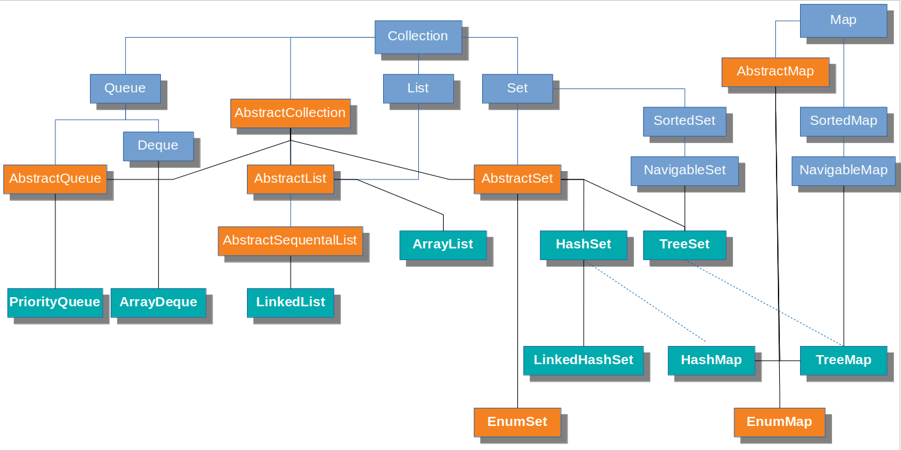

## Java Collections Framework

### EnumSet
Efficient for Enums, since this type of set stores enums as an array of bits. It is possible due to predefined information about available Enum's sizes and order:

`Note that each enum type has a static values method that returns an array containing all of the values of the enum type in the order they are declared.`

Just for illustration: MyEnum {A, B, C, D, E} represents as [1, 1, 1, 1, 1]. To compare it with another EnumSet, which contains MyEnum {A,D,E} [1, 0, 0, 1, 1] – jvm should perform only single bitwise operation. Sure, this `O(1)` is much faster than `hashcode` computation.

### EnumMap
The keys are single Enum type, values - any of available. EnumMap maintain entries in `NATURAL ORDER`, i.e. in `ORDER` of Enum constants, declared in Enum class. Most operations are `O(1)` as for EnumSet.

### ArrayDeque
Simple enough, uses array as a back-store, allows to `add` and `poll` elements from both sides.

### PriorityQueue
Differs from standard FIFO queue such that - allows to store elements in `NATURAL ORDER` by default or by custom order, based on Comparator, that can be passed in constructor.

### LinkedList
Doubly-linked list. Worst access time is N/2, since iteration can be start from both sides. It is very ineffective collection due to objects allocation and their references. During elements addition object instances can be scattered across heap, therefore it is less likely that multiple elements will fall into processor's cache within single read operation from RAM memory.

### ArrayList
Access by index is `O(1)`, since back-store is a simple array. Actually it is a very efficient data structure for most use cases. Adding an element in the middle of array requires shifting the rest of the array using native `System.arraycopy`. Benchmarks shows, that `System.arraycopy` is about two times faster than `O(n)` `for` loop.
