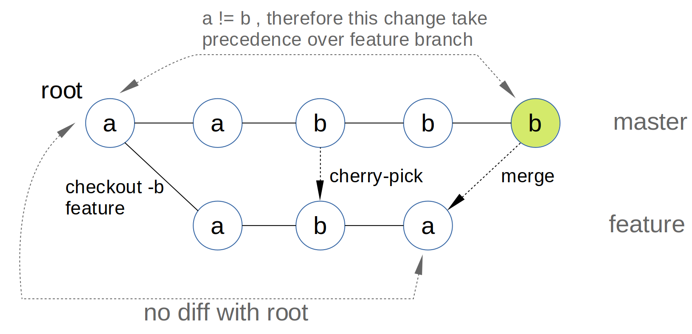

## ABA ISSUE :

Cycle:
1. creation of `feature` branch (value is still `a`)
2. in `feature` branch temporary bug-fix is commited, changing `a` to `b`
3. the bug-fix need to be delivered to production as fast as possible, 
   therefore commit with value `b` is cherry-picked to `master` branch for further propagation
4. core functionality is fixed and temporary bug-fix need to be reverted, thus changing `b` to `a` again
5. time for merging `feature` branch to `master` is coming with consequent meeting `a-b-a` problem:
    * git seeking for closest parent - `root`
    * comparing `root` and last `feature` commit leads to the conclusion `doesn't changed` (since the line value is the same - `a`)
    * comparing `root` and last `master` commit leads to the conclusion `was changed` (since `a != b`)
    * so, the changed value `b` take precedence over unchanged `feature` branch `a` value

***The worst thing is that git won't warn, won't introduce any merge conflicts, since comparing values with root commit is clear enough***
