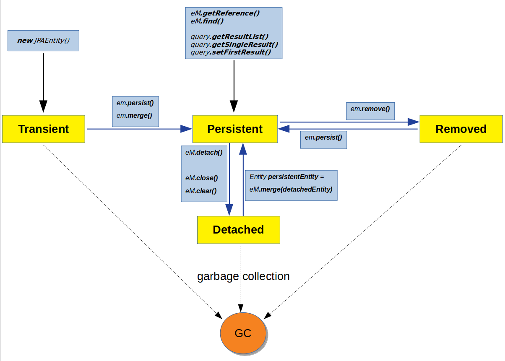

## Transient
- _any JPA entity created by **new** keyword_
- _not associated with **persistenceContext**_
- _**merge() & remove()** both operations transfer entity to persistent state (since entity begins to be associated with table/row)_

## Persistent
- _associated with **persistenceContext**_
- _entity synchronization (creation/modification) with database performs during commit_

## Detached
- _not associated with **persistenceContext**_
- _**currentSession.close()** triggers entity transfer from persistent to detached state_
- _exception is thrown when you call entity's lazy fields (since session is already closed)_
- _**merge()** is useful operation for synchronization detached entity with database and transfering to persistent state_

## Removed
- _**lifecycle:** fetched from database **->** marked for deletion **(removed state)** **->** actually removed from database during commit_
