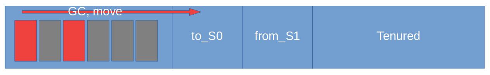
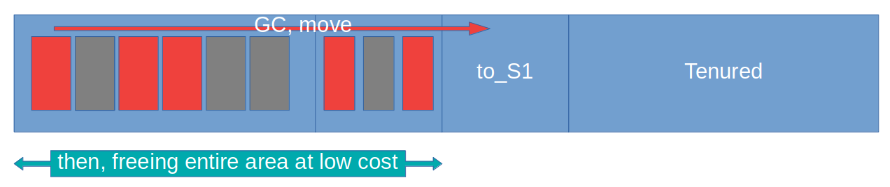
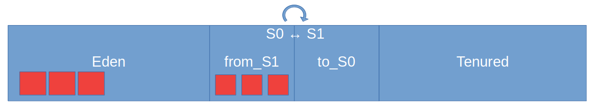

## HotSpot Garbage Collection Lifecycle

#### GC types:

1. **Minor GC** - covers Eden and Survivor's spaces
2. **Major GC** - covers Tenured space
3. **Full GC** - covers Tenured and Metaspace areas

```java
  if(Eden space is full)
      Minor GC, move to Survivor
      if(Threshold is reached)
          move to Tenured
          if(Tenured is full)
              Major GC, evict Tenured
              if(Heap is over)
                  Full GC, evict entire Heap, Metaspace
```

#### Minor GC

Once `Eden` space is filled, minor GC marks reachable objects for further transfer to `S0`.



`Eden` space is filled again and now minor GC scans `Eden` and `S0` as contigious area, marking reachable objects from both spaces for further transfer to `S1`.
After transfer completed, GC can easely throw out entire area of unreachable objects.



Now, all reachable objects are located at `S1` and Survivor's spaces should be swapped for the next `Minor GC` iteration, i.e. aftewards,`Minor GC` will scan `Eden` and `S1` for reachable objects.

`Eden` space will be filled again and the previous step will be repeated. Reachable objects will be transfered from `Eden` and `S1` to empty `S0` space.



After every `Minor GC` iteration, reachable object's `age` increments by 1.

There is `MaxTenuringThreshold` JVM option (by default = 15), upon reaching of which objects promotes to `Tenured` space.

#### Major GC

`Major GC` triggers when `Tenured` space is filled and therefore scans `Tenured` space for eligible objects.

#### Full GC

`Full GC` is triggered when there is no free space at heap and JVM trying to cope with this situation by scanning entire `Heap` and `Meta Space` too. If there is no objects on the heap related to specific class on the `Meta Space` then `Full GC` evicts this class objects from `Meta Space`.
