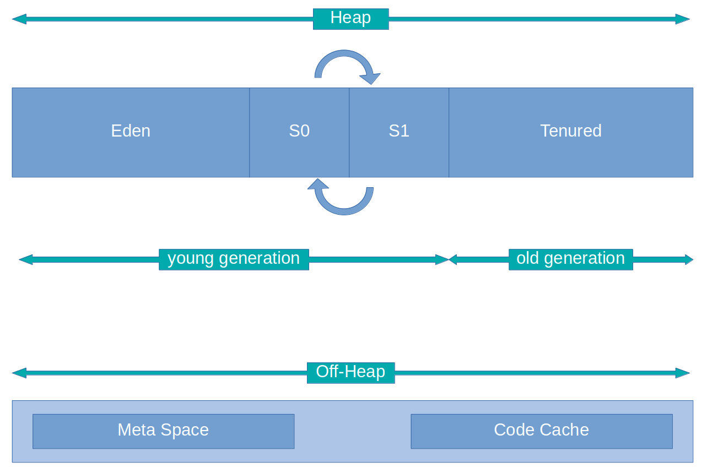

## HotSpot Memory Model

### Heap areas:

***Eden -*** every object instantiated by `new` or via reflection `Class.newInstance()` falls into Eden (nicely).

***Survivors S0 / S1 -*** temporary swappable areas that stores objects, which didn't reach `MaxTenuringThreshold` age, by default is 15.

***Tenured -*** objects, which reached `MaxTenuringThreshold`, moved from Survivor area.

### Off-Heap areas:

***Meta Space -*** stores class definitions, that are loaded via classloaders.

***Code Cache -*** this is a area, where JIT compiler stores optimized native code blocks, which doesn't need to be interpreted by JVM, they are invokes as it is.

