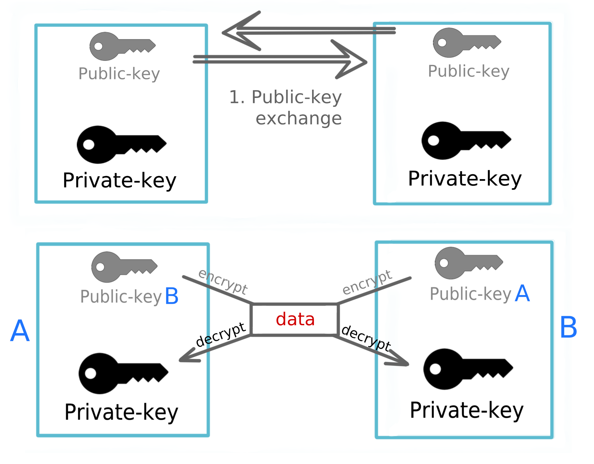

### TLS
**TLS** (Transport Layer Security) is a secure network protocol evolved from SSL (Secure Sockets Layer). **TLS** allow to establish secure communication channel between Client and the Server. It operates directly on top of TCP and extensively utilized by HTTPS transport protocol.

Primarily, it includes:
1. Conversational algorithm named `Handshake` to establish server identity - `Server Authentication`.   
`Handshake` also may include `Client Authentication` to forbid the access to server for untrusted clients.
2. `Record algorithm` for encrypting outgoing and decrypting incoming messages using `Symmetric` `Session Key` obtained during `Handshake` (`Handshake` step uses `Asymmetric` Public/Private keys).

So, in order to provide secure Client/Server interaction, there must be two steps involved:
1. Verify server identity (`Handshake`), using Asymmetric Public/Private key. This step can be done using so-called **PKI** which relies on `Certificate`'s.
2. Encrypt/Decrypt network messages, using Symmetric single key. After `Handshake` the slow `Asymmetric` approach is replaced by efficient and fast `Symmetric` encryption.

**PKI** (Public Key Infrastructure) :   
designates the class of cryptographic algorithms and approaches. Includes the following encryption and signing techniques:
- Certificate
- Asymmetric encryption algorithm
- Key exchange algorithm (based on `Key Pair`)

Mathematical relation of `Key Pair` is as follow:   
**Public Key** can be used to encrypt message, while only corresponding **Private Key** can decrypt it.   
**Private Key** can also be used to `sign` message, while only corresponding **Public Key** can verify, that the message was indeed signed by the owner of **Private Key**.

**RSA** (Rivest–Shamir–Adleman) :   
One of the commonly used `Asymmetric Encryption` algorithm, based on `Key Pair`.
1. Participants exchange their public keys
2. Every participant uses opponent's `Public key` to encrypt outgoing message and his own `Private Key` to decrypt incoming message.

***[The Math behind RSA](rsa_math.md)***

**Certificates are divided on CA and Self-Signed certificates:**   
...

**Symmetric Key vs Asymmetric Key encryption:**   
...

**Common TLS Handshake algorithm:**   
...
