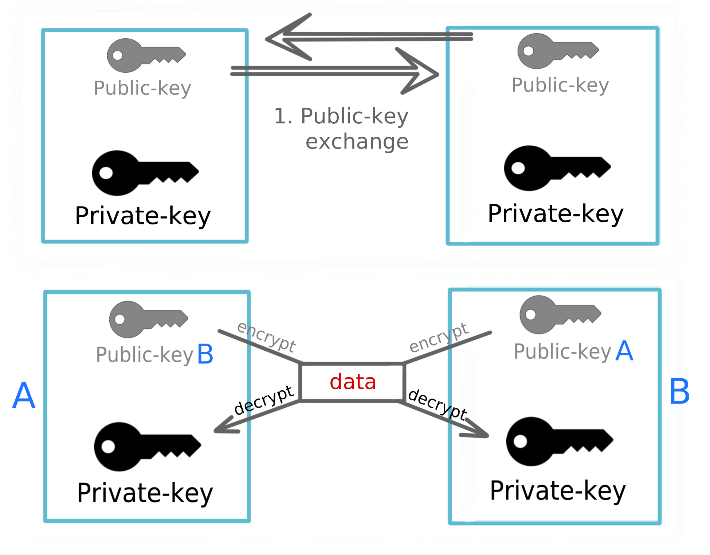

### TLS
**TLS** (Transport Layer Security) is a secure network protocol evolved from SSL (Secure Sockets Layer). **TLS** allow to establish secure communication channel between Client and the Server. It operates directly on top of TCP and extensively utilized by HTTPS transport protocol.

Primarily, it includes:
1. `Conversational` algorithm named `Handshake` to establish server identity - `Server Authentication`.   
`Handshake` also may include `Client Authentication` to forbid the access to server for untrusted clients.
2. `Record` algorithm to encrypt outgoing and decrypt incoming messages using `Symmetric` `Session Key`, obtained during `Handshake` (`Handshake` step uses `Asymmetric` Public/Private keys).

So, in order to provide secure Client/Server interaction, there are two steps involved:
1. Verify server identity (`Handshake`), using Asymmetric Public/Private key. This step can be done using so-called **PKI** which relies on signed `Certificate`'s.
2. Encrypt/Decrypt network messages, using Symmetric single key (after `Handshake` the slow `Asymmetric` approach is replaced by efficient and fast `Symmetric` encryption).

**PKI** (Public Key Infrastructure) :   
designates the class of cryptographic algorithms and approaches. Includes the following encryption and signing techniques:
- Certificate
- Asymmetric encryption algorithm
- Key exchange algorithm (based on `Key Pair`)

Mathematical relation of `Key Pair` is as follow:   
**Public Key** can be used to encrypt message, while only corresponding **Private Key** can decrypt it.   
**Private Key** can also be used to `sign` message, while only corresponding **Public Key** can verify, that the message was indeed signed by the owner of **Private Key** (e.g. sign issued certificate with CA's private key and further verify it with public key).

**RSA** (Rivest–Shamir–Adleman) :   
One of the commonly used `Asymmetric Encryption` algorithm, based on `Key Pair`.
1. Participants exchange their public keys
2. Every participant uses opponent's `Public key` to encrypt outgoing message and his own `Private Key` to decrypt incoming message.

***[The Math behind RSA](RSA_MATH.ipynb)***

**Certificate content:**   
* Subject name (domain name of requresting server / cert owner)   
* Issuer name (domain name of CA)   
* Version   
* Serial number
* Not valid before (date)   
* Not valid after (date)  
* Cert fingerprints (SHA1, MD5)   
* Public key info   (Algorithm (e.g. RSA), Size, SHA1 Figerprint, Public key itself)

**Certificates are divided on CA and Self-Signed certificates:**    

Self-Signed certificate simply differs by the issuer, i.e. while CA-certificate is issued by dedicated Central Authority, the Self-Signed one could be obtained just using another own Key Pair without intervention of CA. It's a common approach for testing purposes where certificate's owner controls the environment.

**Symmetric Key vs Asymmetric Key encryption:**   

Comparing RSA (asymmetric) and AES-128 (128-bit symmetric) algorithms, there are several drawbacks of asymmetric encryption which makes symmetric one suitable for intensive secure communication:
1. AES-128 
2. 
3. 

**Common TLS Handshake algorithm:**   
...
