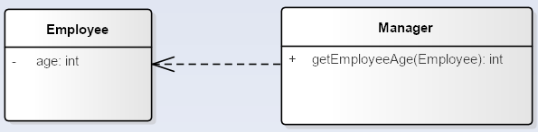
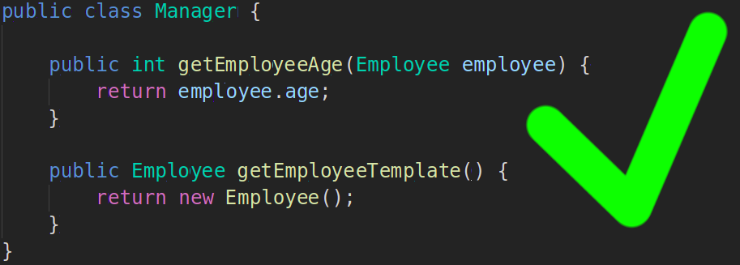
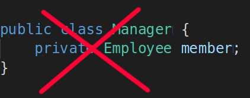

- # Dependency

Class Manager **use** class Employee as method argument.

Manager also can create an new instance of type Employee inside some factory method (i.e. on stack).

_**But it mustn't contain any member of type Employee**_.

- # Direct Association

It is much like **Dependency** , but represents much stronger relationship.

In this contrived case **Offer** object doesn't know anything about **Employee**, vice versa - only **Employee** knows about recieved offer, and correspondingly contain's an instance of **Offer** class as a member.

Oposite to previous wrong Dependency example, it is ok for Association to represent relationship as a class member variable:

- # Bidirectional Association

- # Aggregation

- # Composition

- # Generalization

- # Realization
