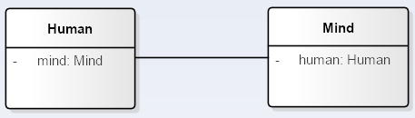
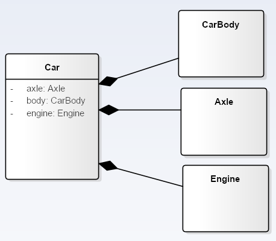

- # Dependency

Class Manager **use** class Employee as method argument.

Manager also can create an new instance of type Employee inside some factory method (i.e. on stack).

_**But it mustn't contain any member of type Employee**_.

- # Direct Association

It is much like **Dependency** , but represents much stronger relationship.

In this contrived case **Offer** object doesn't know anything about **Employee**, vice versa - only **Employee** knows about recieved offer, and correspondingly contain's an instance of **Offer** class as a member.

Oposite to previous wrong Dependency example, it is ok for Association to represent relationship as a class member variable:

- # Bidirectional Association

Same as Direct Association, but every participant know's about each other.

- # Aggregation

In practical application Aggregation means the collection or set of objects, whose state doesn't directly affect Aggregator.
As example : the only state on which **amount (not students directly)** of Students can influence is "empty classroom" or "full classroom", but anyway Classroom with zero, half or full amount of students is still Classroom.

- # Composition

The main feature of Composition  in contrast to Aggregation are Compositor members. Without at least one member - Compositor can't represents fully qualified Object, e.g. it's hard to call an object a modern Car without engine , body or axle.
The set of objects like engine, body and axle represents modern Car.

- # Generalization

- # Realization
