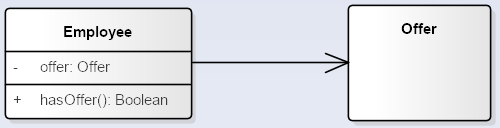
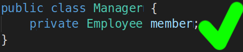

- # Dependency

Class Manager **use** class Employee as method argument.

Manager also can create an new instance of type Employee inside some factory method (i.e. on stack).

_**But it mustn't contain any member of type Employee**_.

- # Association

It is much like **Dependency** , but represents much stronger relationship.

Oposite to previous wrong Dependency example, it is ok for Association to represent relationship as member variable:

