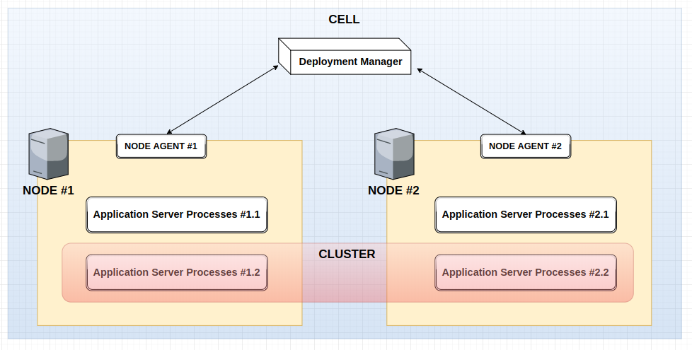

## Brief overview of Websphere structure
_There are a lot of logical groups / managers etc., that allow's to implement different approaches for distributed system organization (e.g. vertical or horizontal scalability), but this part doesn't cover it..._

### Cell 
it's what is commonly named to cluster (except ibm). _Logical group_, that consists of nodes, allows to perform global administrative tasks via deployment manager in distributed environment.

### Deployment Manager 
just a process within cell, that has access and controls application servers content. Communicates with node's via node agent's.

### Node Agent
communicates with deployment manager for WAS configuration synchronization and control

### Node
usually represents physical machine and corresponding logical group of application servers, which are located on this machine

### Cluster
another logical group of application servers. Unlike Node cluster usually not located on single machine, but groups servers across nodes. Cluster allows you to share special resources only within cluster and synchronize WAS instances, while working as single unit as one of the part of a system.

